# BEP to OpenTelemetry Converter - Rust MVP Plan

## Usage Model: Bazelisk Extension

The conduit runs as a **local sidecar** started by bazelisk, not a centralized service:

```
┌─────────────┐     starts      ┌─────────────┐
│  bazelisk   │ ───────────────▶│   conduit   │ (gRPC server on localhost:port)
└─────────────┘                 └─────────────┘
       │                               │
       │ bazel build --bes_backend=    │
       ▼                               │
┌─────────────┐     BEP stream         │
│    bazel    │ ───────────────────────┘
└─────────────┘
```

### Input Modes

| Mode | Use Case |

|------|----------|

| **gRPC** (`--bes_backend`) | Primary: Real-time BEP stream from Bazel |

| **JSON file** | Debugging/replay: Read saved BEP JSON file |

---

## Scope: Lightweight Processing Only

When `--build_event_publish_all_actions` is detected in `OptionsParsed`:

```rust
pub enum ActionProcessingMode {
    Lightweight,  // MVP: Only failed actions create spans
    Full,         // Stub: unimplemented!()
}

fn handle_action(&self, action: &ActionExecuted) -> Result<()> {
    match self.mode {
        ActionProcessingMode::Lightweight if !action.success => {
            self.create_action_span(action)
        }
        ActionProcessingMode::Lightweight => Ok(()),  // Skip successful
        ActionProcessingMode::Full => {
            tracing::warn!("Full action processing not yet implemented");
            unimplemented!("Full action span processing")
        }
    }
}
```

---

## Development Phases

```mermaid
flowchart LR
    subgraph phase0 [Phase 0: Bazel Setup]
        RulesRust[rules_rust]
        CrateUniverse[crate_universe]
        Gazelle[gazelle-rust]
        RustProto[rust_prost_library]
    end
    
    subgraph phase1 [Phase 1: Analysis]
        Decode[BEP Decoder]
        Router[Event Router]
        State[State Tracking]
    end
    
    subgraph phase2 [Phase 2: Mapper]
        TraceCtx[TraceContext]
        Registry[SpanRegistry]
        OtelMap[OTel Mapper]
    end
    
    subgraph phase3 [Phase 3: Export]
        DDExport[Datadog Exporter]
        gRPCSvc[BES gRPC Server]
    end
    
    phase0 --> phase1 --> phase2 --> phase3
```



---

## Phase 0: Bazel + Rust Setup

### Starting Point

Use commit `c9c56cc` ("Introduce main go_proto_library targets for BEP") as reference - it has:

- `proto_library` targets (language-agnostic)
- `rules_proto`, `protobuf`, `googleapis` dependencies
- Basic `MODULE.bazel` structure

### Add to MODULE.bazel

```starlark
# Existing (keep)
bazel_dep(name = "rules_proto", version = "7.1.0")
bazel_dep(name = "protobuf", version = "33.1")

# New for Rust
bazel_dep(name = "rules_rust", version = "0.56.0")

# crate_universe for Cargo dependency management
crate = use_extension("@rules_rust//crate_universe:extension.bzl", "crate")
crate.from_cargo(
    name = "crates",
    cargo_lockfile = "//rust/conduit:Cargo.lock",
    manifests = ["//rust/conduit:Cargo.toml"],
)
use_repo(crate, "crates")

# Prost for protobuf (uses crate_universe internally)
crate.annotation(
    crate = "prost",
    # Any prost-specific config
)

# Gazelle with Rust extension
bazel_dep(name = "gazelle", version = "0.47.0")
# Configure gazelle-rust for BUILD file generation
```

### Cargo.toml (rust/conduit/Cargo.toml)

```toml
[package]
name = "conduit"
version = "0.1.0"
edition = "2021"

[dependencies]
# Proto
prost = "0.13"
prost-types = "0.13"

# OTel
opentelemetry = "0.27"
opentelemetry-otlp = { version = "0.27", features = ["grpc-tonic"] }
opentelemetry_sdk = { version = "0.27", features = ["rt-tokio"] }

# gRPC
tonic = "0.12"

# Async
tokio = { version = "1", features = ["full"] }

# Concurrency
dashmap = "6"

# CLI
clap = { version = "4", features = ["derive"] }

# Logging
tracing = "0.1"
tracing-subscriber = { version = "0.3", features = ["env-filter"] }

# Utils
uuid = { version = "1", features = ["v4"] }
serde = { version = "1", features = ["derive"] }
serde_json = "1"
thiserror = "2"

[build-dependencies]
tonic-build = "0.12"
```

This setup uses **crate_universe** to:

- Read `Cargo.toml` for dependencies
- Generate `Cargo.lock` for reproducibility  
- Create Bazel targets like `@crates//:prost`, `@crates//:tokio`, etc.

### Add Rust Proto Targets

In [proto/build_event_stream/BUILD.bazel](proto/build_event_stream/BUILD.bazel), add:

```starlark
load("@rules_rust_prost//:defs.bzl", "rust_prost_library")

# Reuse existing proto_library
rust_prost_library(
    name = "build_event_stream_rust_proto",
    proto = ":build_event_stream_proto",
    visibility = ["//visibility:public"],
)
```

### Rust Crate Structure

```
rust/
├── conduit/
│   ├── Cargo.toml      # For IDE support (cargo check)
│   ├── BUILD.bazel     # rust_binary, rust_library
│   └── src/
│       ├── main.rs
│       └── lib.rs
```

### Deliverable

- `bazel build //rust/conduit:conduit` compiles Rust binary
- Proto types available via `//proto/build_event_stream:build_event_stream_rust_proto`

---

## Phase 1: Analysis (BEP Parsing)

### Components

| Component | Purpose |

|-----------|---------|

| **BEP Decoder** | Unwrap `google.protobuf.Any` → `BuildEvent` |

| **Event Router** | Pattern match `BuildEventId` variants |

| **Build State** | Track lifecycle, parents, configurations |

| **Action Mode Detector** | Parse `OptionsParsed` for flag |

### Key Implementation

```rust
// Direct protobuf processing (no JSON intermediate)
fn decode_build_event(any: &prost_types::Any) -> Result<BuildEvent> {
    if any.type_url.ends_with("BuildEvent") {
        BuildEvent::decode(&any.value[..])
            .map_err(|e| Error::DecodeError(e))
    } else {
        Err(Error::UnknownEventType(any.type_url.clone()))
    }
}

// Event routing via pattern matching
fn route_event(&mut self, event: &BuildEvent) -> Result<()> {
    match &event.id {
        Some(BuildEventId { id: Some(id) }) => match id {
            build_event_id::Id::Started(_) => self.handle_started(event),
            build_event_id::Id::OptionsParsed(_) => self.handle_options(event),
            build_event_id::Id::TargetConfigured(t) => self.handle_configured(t, event),
            build_event_id::Id::TargetCompleted(t) => self.handle_completed(t, event),
            build_event_id::Id::ActionCompleted(a) => self.handle_action(a, event),
            build_event_id::Id::BuildFinished(_) => self.handle_finished(event),
            // ... other events
            _ => Ok(()),  // Ignore unknown
        },
        _ => Ok(()),
    }
}
```

### Deliverable

- Parse BEP from JSON file or gRPC stream
- Detect action mode from `OptionsParsed`
- Route events to handlers

---

## Phase 2: Mapper (BEP → OTel)

### Components

| Component | Purpose |

|-----------|---------|

| **TraceContext** | UUID→TraceID, trace-level attributes |

| **SpanRegistry** | Track open spans by target/action |

| **NamedSetCache** | Resolve output file references |

| **Attributes** | Type-safe attribute extraction |

| **Mapper** | BEP events → OTel spans |

### Span Hierarchy (Lightweight)

```
bazel.invocation (root, BuildStarted → BuildFinished)
├── bazel.target (TargetConfigured → TargetCompleted)
│   └── bazel.action.{mnemonic} (FAILED only in lightweight mode)
```

### Deliverable

- Produce OTel span data from BEP events
- Correct parent-child relationships
- Lightweight: Only failed actions create spans

---

## Phase 3: Exporter + gRPC Service

### Datadog Exporter

Uses `opentelemetry-otlp` to send traces to Datadog Agent:

```rust
pub struct DatadogExporter {
    endpoint: String,  // Default: localhost:4317
    exporter: opentelemetry_otlp::SpanExporter,
}
```

### BES gRPC Server

Implements `PublishBuildEvent` service for `--bes_backend`:

```rust
#[tonic::async_trait]
impl PublishBuildEvent for BesService {
    type PublishBuildToolEventStreamStream = ...;
    
    async fn publish_build_tool_event_stream(
        &self,
        request: tonic::Request<tonic::Streaming<PublishBuildToolEventStreamRequest>>,
    ) -> Result<Response<Self::PublishBuildToolEventStreamStream>, Status> {
        // Process BEP stream, create spans, export to Datadog
    }
}
```

### Deliverable

- BES gRPC server for `--bes_backend=grpc://localhost:PORT`
- Traces exported to Datadog Agent

---

## Directory Structure

```
bazel_conduit/
├── MODULE.bazel              # Add rules_rust
├── proto/
│   └── build_event_stream/
│       ├── BUILD.bazel       # Add rust_prost_library
│       └── ...
└── rust/
    └── conduit/
        ├── BUILD.bazel       # rust_binary, rust_library
        ├── Cargo.toml        # IDE support
        └── src/
            ├── main.rs       # CLI entry (clap)
            ├── lib.rs
            ├── bep/          # Phase 1
            │   ├── mod.rs
            │   ├── decoder.rs
            │   └── router.rs
            ├── state/        # Phase 1
            │   ├── mod.rs
            │   ├── build_state.rs
            │   └── action_mode.rs
            ├── otel/         # Phase 2
            │   ├── mod.rs
            │   ├── trace_context.rs
            │   ├── span_registry.rs
            │   ├── namedset_cache.rs
            │   ├── attributes.rs
            │   └── mapper.rs
            ├── export/       # Phase 3
            │   ├── mod.rs
            │   ├── traits.rs
            │   └── datadog.rs
            └── grpc/         # Phase 3
                ├── mod.rs
                └── bes_service.rs
```

---

## CLI Interface

```
conduit [OPTIONS]

Options:
  --input <FILE>          Read BEP from JSON file
  --grpc-port <PORT>      Start BES gRPC server [default: 8080]
  --dd-agent <ENDPOINT>   Datadog Agent endpoint [default: localhost:4317]
  --log-level <LEVEL>     Log level [default: info]
```

---

## What's NOT in MVP

| Feature | Status |

|---------|--------|

| Full action processing | `unimplemented!()` |

| Phase spans | Deferred |

| Span links (DAG) | Deferred |

| Test events | Deferred |

| Sampling policies | Deferred |

| JSON exporter | Deferred (Datadog first) |